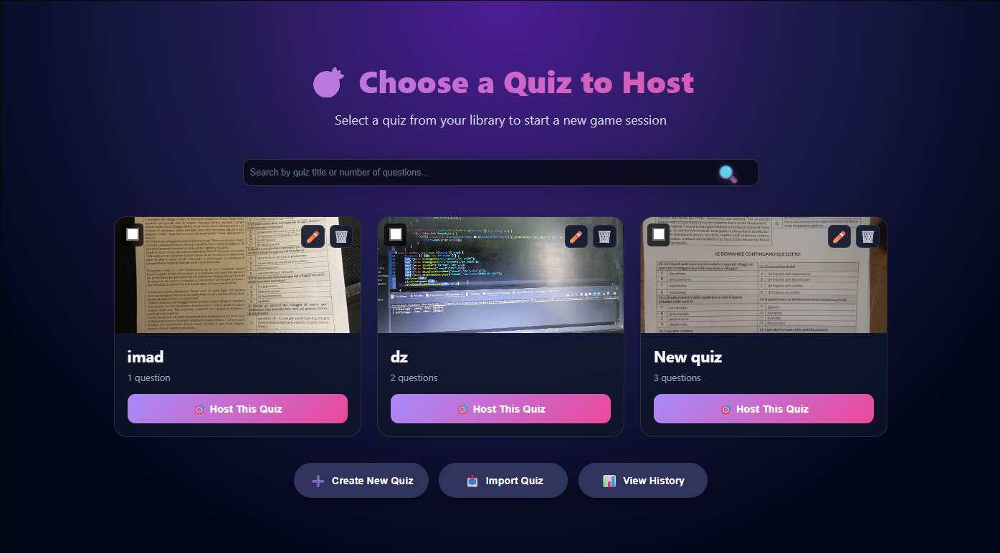
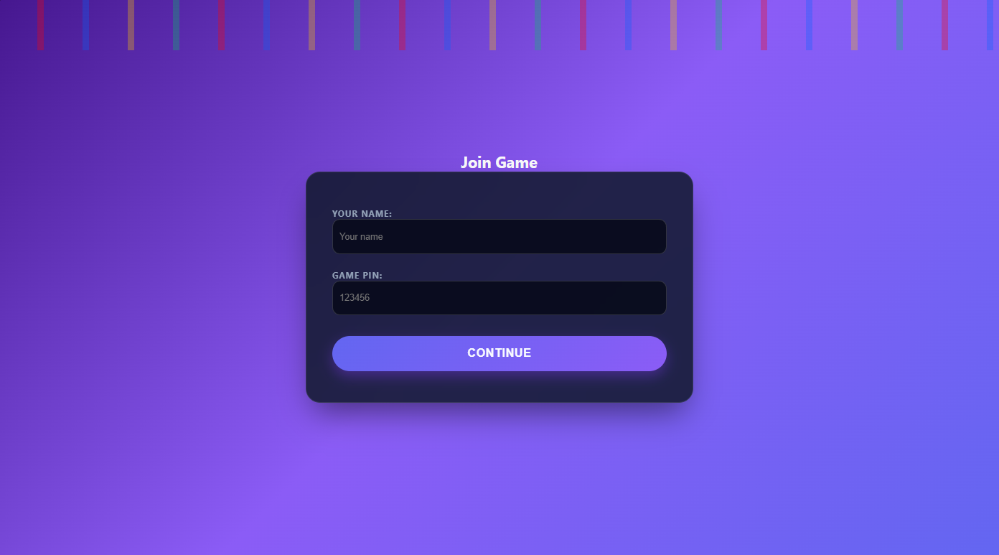
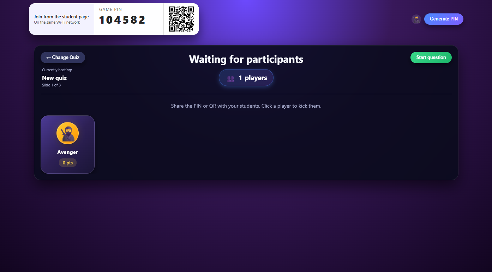

# QuizLAN 🧠📡
A fast, lightweight, Kahoot-style quiz system designed to run entirely on your **local network** (LAN/Wi-Fi).  
Includes a full **Teacher interface** and **Student interface**, real-time updates, and PIN-based game sessions.

---

## ✨ Features

### 👩‍🏫 Teacher Interface
- Create quizzes or import them as files  
- Start and manage quiz sessions  
- Control slides  
- Monitor student connections  
- View live responses  
- Store and browse quiz history  

### 👨‍🎓 Student Interface
- Join using a PIN code  
- Clean, fast answering interface  
- Real-time reaction to teacher actions  
- Encouraging or sarcastic messages (optional)  

### 🌐 Local Network Support
- 100% offline — no external server required  
- Works on classroom Wi-Fi or LAN  
- All communication happens directly over your IP address  

### 🧱 Tech Stack
- **Backend:** Python, Flask  
- **Frontend:** HTML, CSS, JavaScript  
- **Files:** Quizzes stored or uploaded (JSON / CSV depending on your implementation)

---

## 🚀 Installation

### 1️⃣ Install dependencies
```bash
pip install flask
```

Or:
```bash
pip install -r requirements.txt
```

### 2️⃣ Run the server
```bash
python app.py
```

### 3️⃣ Access the interfaces

#### Teacher interface
```
http://<server-ip>:5000/teacher
```

#### Student interface
```
http://<server-ip>:5000/student
```

> Replace `<server-ip>` with your local IP (example: `192.168.1.12`).  
> Make sure `app.run(host="0.0.0.0")` is set inside `app.py` for LAN access.

---

## 📂 Project Structure

```
.
├── app.py
├── README.md
├── requirements.txt
├── .gitignore
├── LICENSE
│
├── student/
│   ├── student.html
│   └── student.js
│
├── teacher/
│   ├── teacher.html
│   └── teacher.js
│
├── style/
│   └── style.css
│
├── uploads/
│   └── .gitkeep
│
└── screenshots/
```

---

## 🧩 How It Works

1. Teacher opens `/teacher` and creates/imports a quiz  
2. A **PIN** is generated  
3. Students open `/student` and enter the PIN  
4. Teacher controls slides/questions  
5. Students answer in real time  
6. Teacher reviews results + history  

---

## 🛠️ Configuration

You can customize:
- Quiz file formats   
- Scoreboards / leaderboards  

---

## 📸 Screenshots

### Teacher View


### Student View


### Lobby Screen


---

## 📜 License
This project is open-source under the **MIT License**.  
Users may copy, modify, or distribute the project freely.

---

## 🙌 Credits
QuizLAN was built as a **local alternative to Kahoot**, focused on speed, simplicity, and flexibility for classroom or LAN gaming environments.
